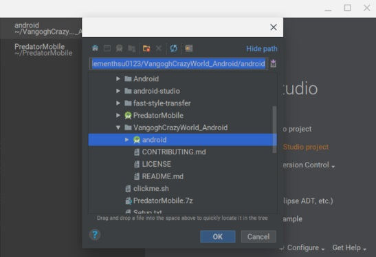

# Quick Start
Following the steps here, you can easy setup the environment in your Chromebook. Then, build an Android APK about Vangogh Crazy World to run on your Chromebook or your android phone.
Setup steps as following:
1. Open Setting Menu and Enable Linux, then Enable Linux console on task bar

2. Download the <a href="https://github.com/acerwebai/VangoghCrazyWorld-Android/releases/download/1.00/VangoghCrazyWorld_Android.zip">latest release build </a> to setup your environment for building android APK for Vangogh Crazy World in Chrome OS.  
3. Copy “VangoghCrazyWorld_Android_20190214.zip” into Linux working folder.

4. Unzip VangoghCrazyWorld_Android_20190214.zip on Linux Console
5. Open the Setup.txt on Linux file folder

6. Follow Setup.txt to install and launch Android Studio

7. Choose the project on “VangoghCrazyWorld_Android” folder

8. Sync process will be executed automatically and will show sync successfully.

9. Press “Rebuild project”.

10. When the build process completed, the ”android-debug.apk” will be generated under the folder of “VangoghCrazyWorld_Android”.

11. Copy ”android-debug.apk” file into your working folder on chrome OS. ex. Download.

12. Double click the APK file, then select INSTALL, the install process will be executed, after the process completed, your APK will be shown on the APP list of chromebook.

13. Select OPEN to launch this AP, allow all permissions.

14. Launch “TF Stylize” on your chromebook APP list and Enjoy it.

